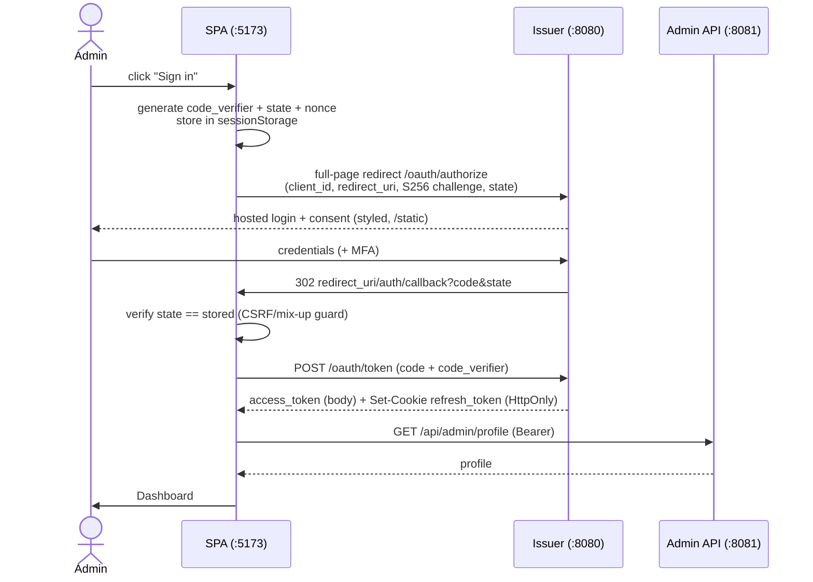
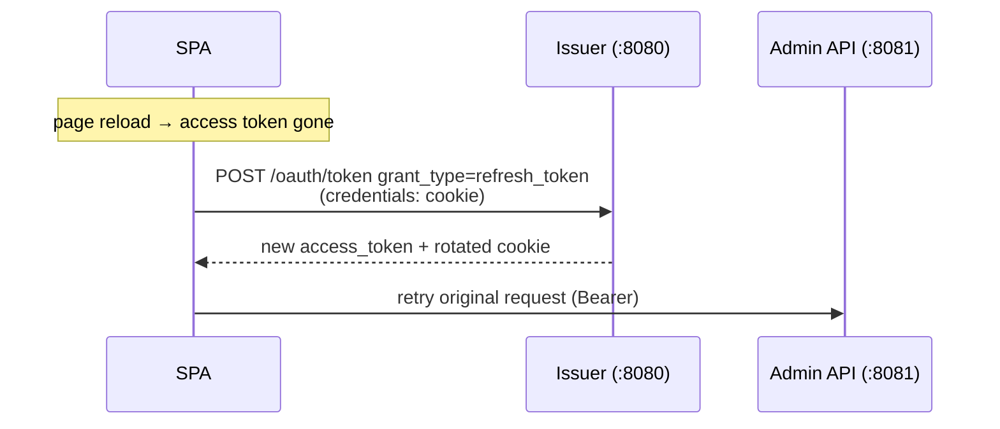
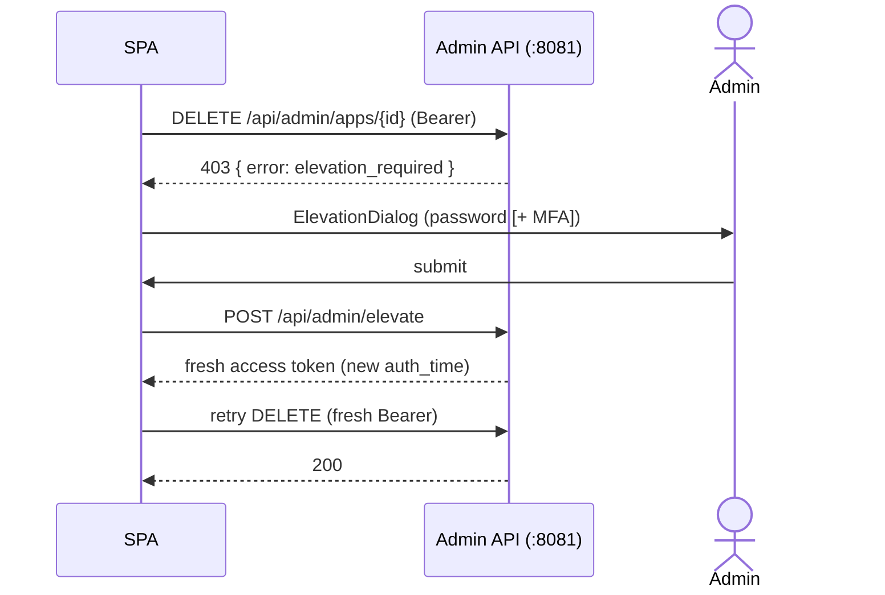

# Architecture

The Socrate Superadmin Portal is a Vue 3 single-page application (SPA) and the
privileged admin surface for the Socrate OAuth2 / OpenID Connect platform
(`go-oauth2`). It is a **first-party, public OAuth client** — it has no secret
and authenticates via **Authorization Code + PKCE**, delegating login to the
authorization server's hosted page.

- For the security controls, see [`SECURITY.md`](./SECURITY.md).
- For local setup, see [`docs/getting-started.md`](./docs/getting-started.md).
- For the decisions behind this design, see [`docs/adr/`](./docs/adr/).

---

## 1. The two origins

Socrate runs **split-port**, exposing two origins that do **not** overlap. The
SPA must be configured with both:

| Origin (dev) | Role | Serves | SPA env var | Auth |
|---|---|---|---|---|
| `http://localhost:8080` | **OIDC issuer** (authorization server) | `/oauth/*`, `/api/auth/*`, `/api/profile`, `/.well-known/*`, `/static/*` | `VITE_OIDC_ISSUER` | PKCE + refresh **cookie** |
| `http://localhost:8081` | **Admin resource server** | `/api/admin/*` only | `VITE_ADMIN_API_URL` | **Bearer** access token |

> The issuer (where you authenticate and get tokens) and the resource server
> (the admin API you call with the token) are **separate services**. A single
> base URL cannot address both. In production a single gateway may front both —
> then both vars point at it (or `VITE_OIDC_ISSUER` is left unset to default to
> `VITE_ADMIN_API_URL`).

```
                         ┌────────────────────────────────────────┐
   Browser (SPA @ :5173) │                                        │
   ─────────────────────►│  :8080  OIDC issuer / public           │
   authorize · token ·   │   /oauth/authorize  /oauth/token        │
   refresh · logout ·    │   /api/auth/logout  /api/profile        │
   profile · pwd reset   │   /static/* (hosted login assets)       │
                         └────────────────────────────────────────┘
   ─────────────────────►┌────────────────────────────────────────┐
   Bearer access token   │  :8081  admin resource server          │
   /api/admin/*          │   /api/admin/*  (apps, users, security, │
                         │                  logs, elevate, …)      │
                         └────────────────────────────────────────┘
```

Both calls are cross-origin from the SPA, so the backend must allow CORS for the
SPA origin (`ALLOWED_ORIGINS`) — it covers both ports — and allow the
`X-Requested-By` request header (see [ADR-0005](./docs/adr/0005-custom-header-csrf.md)).

---

## 2. Token & cookie lifecycle

| Token | Where it lives | Lifetime | Notes |
|---|---|---|---|
| **Access token** | JS memory only (`tokenStore` in `src/services/api.ts`) | minutes | Never in `localStorage`/`sessionStorage`. Dropped on reload, re-minted via refresh. Sent as `Authorization: Bearer` to `:8081`. |
| **Refresh token** | **HttpOnly cookie** set by the issuer, `Path=/oauth/token`, `SameSite=Strict`, `Secure` (prod) | hours/days | Never readable by JS. Rotated single-use on each refresh (replay → family revocation). Only ever sent to `:8080/oauth/token`. |
| **PKCE `code_verifier`** | `sessionStorage` (key `socrate.pkce`) | one round-trip | Single-use; cleared on callback, success or failure. |
| **`id_token`** | response body (currently unused for validation) | — | The `/api/admin/profile` call is the trust anchor, not client-side JWT validation. |

---

## 3. Authentication flows

### 3.1 Login — Authorization Code + PKCE



Credentials and MFA are entered on the **issuer's** page — the SPA never sees
them. State validation defends against CSRF / authorization-response mix-up
(RFC 6749 §10.12).

### 3.2 Silent refresh (cold load & on `401`)



One helper, `oauth.refreshAccessToken()`, is the **single refresh path** — used
by both cold-start re-hydration (`authStore.checkAuth`) and the `401` response
interceptor (`api.ts`). The `401` interceptor queues concurrent failures so only
one refresh happens.

### 3.3 Step-up (elevation) for destructive actions



Handled centrally in the `api.ts` interceptor + `services/adminGuards.ts`, so
**every** destructive admin call gets step-up without per-view code. A merely
*refreshed* token is not "fresh" — only re-auth clears the gate.

### 3.4 Forced password change

A `403 { error: password_change_required }` on any `/api/admin/*` call sets a
global flag; the router guard + an `App.vue` watcher route the admin to
`/auth/change-password`. On success the backend revokes all tokens and the SPA
forces a fresh login. See [ADR-0006](./docs/adr/0006-error-code-driven-flows.md).

---

## 4. Application structure

```
src/
├── main.ts                 # app bootstrap (Pinia, router, PrimeVue)
├── App.vue                 # root: global dialogs + password-change watcher
├── router/router.ts        # routes + navigation guards (auth, roles, gates)
├── stores/                 # Pinia: authStore (session), theme, version
├── services/               # the I/O + security layer (see below)
├── views/                  # route components (auth, dashboard, apps, users, …)
├── components/             # reusable UI (security/ElevationDialog, ui/, …)
├── composables/            # useSessionTimeout, useToast, useConfirm, …
├── utils/                  # secureConfig (env), roles, formatDate
├── security/               # csp.ts — canonical CSP/headers (single source)
└── types/                  # shared TS types (auth, user, application, …)
```

### The services layer (the security-critical core)

| Module | Responsibility |
|---|---|
| `services/secureConfig` (`utils/secureConfig.ts`) | Validate & resolve `VITE_ADMIN_API_URL` and `OIDC_ISSUER`; fail-fast on misconfig (HTTPS in prod). |
| `services/oauth.ts` | PKCE login (`beginLogin`/`completeLogin`), `refreshAccessToken` — all against the **issuer**. |
| `services/pkce.ts` | Web Crypto PKCE helpers (S256 challenge, state/nonce). |
| `services/api.ts` | Two axios instances — `api` (admin `:8081`, Bearer) and `issuerApi` (`:8080`, credentials); `tokenStore`; the 401-refresh + 403-challenge response interceptor. |
| `services/adminGuards.ts` | Step-up state machine + forced-password-change flag. |
| `services/authService.ts` | Thin endpoint wrappers, routed to the correct origin. |
| other `*Service.ts` | Domain data access for `/api/admin/*` (apps, users, security, dashboard, settings, monitoring). |

---

## 5. Routing & access control

`router.beforeEach` enforces, in order: the OAuth callback passthrough, the
forced-password-change gate, cold-start re-hydration (`checkAuth`), guest
redirects, `requiresAuth`, and `requiresSuperAdmin`. Roles are normalised to a
canonical set (`super_admin`/`app_admin`/`app_manager`/`viewer`) before any
check — unknown roles fall back to least privilege.

---

## 6. Build & deployment shape

- Vite build → static assets in `dist/` (no inline scripts; content-hashed; no
  source maps).
- The **canonical CSP + security headers** (`src/security/csp.ts`) are served by
  the dev/preview servers and **must be mirrored by the reverse proxy** in
  production — see [`docs/security-headers.md`](./docs/security-headers.md).
- In production a gateway typically fronts both Socrate origins; set
  `VITE_ADMIN_API_URL` (and `VITE_OIDC_ISSUER`, if different) accordingly.
