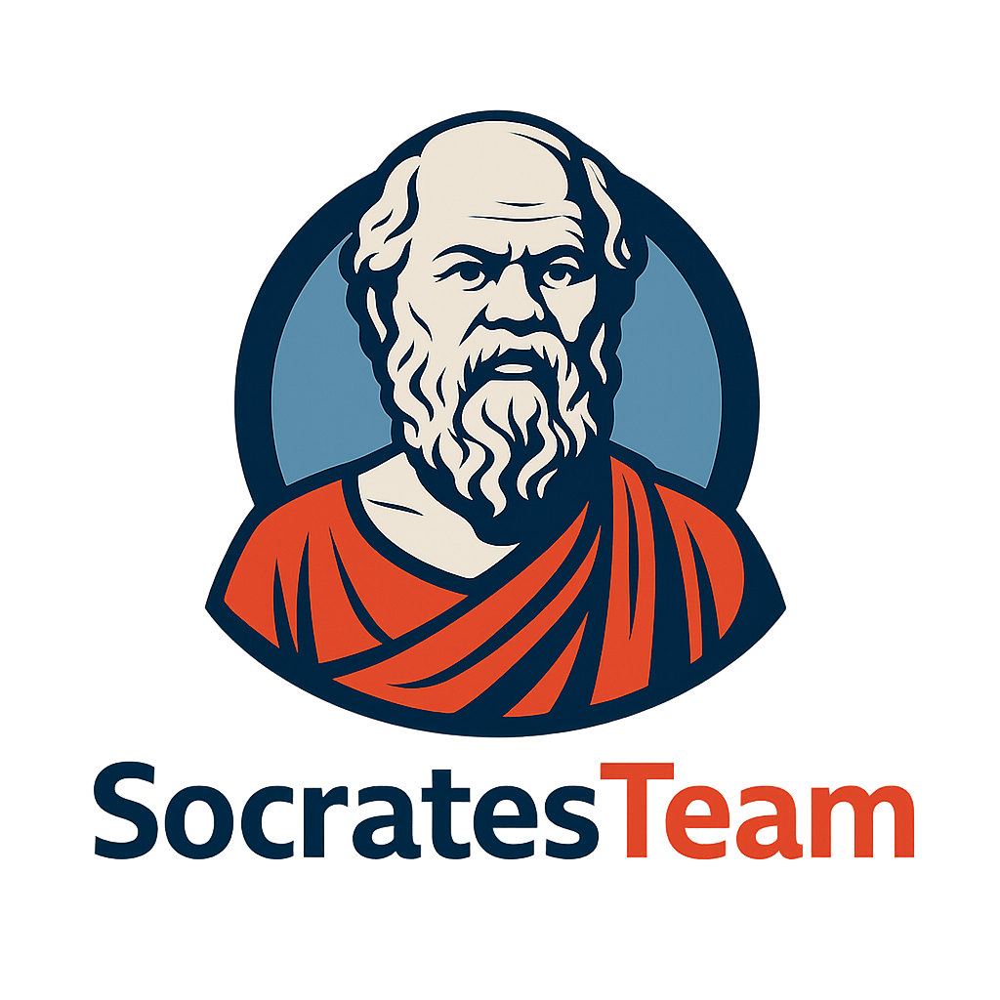

<p align="center">
  
</p>

<h1 align="center">Socrate — Superadmin Portal</h1>

<p align="center">
  The privileged admin console for the
  <a href="https://github.com/ovander/go-oauth2">Socrate</a> OAuth2 / OpenID
  Connect platform — built with Vue 3, PrimeVue 4 and Tailwind CSS 4, and held to
  the same <strong>Tier-0</strong> hardening bar as the backend.
</p>

<p align="center">
  
  
  
  
</p>

> ⚠️ **Superadmins only.** This portal manages the OAuth2 server — applications,
> global users, and server-wide security. App Admins should use their
> application's own admin interface.

## Documentation

| Doc | What's in it |
|---|---|
| [`docs/getting-started.md`](./docs/getting-started.md) | Local setup end-to-end (incl. backend prerequisites) + a troubleshooting table |
| [`ARCHITECTURE.md`](./ARCHITECTURE.md) | Two-origin model, token/cookie lifecycle, auth-flow sequence diagrams |
| [`SECURITY.md`](./SECURITY.md) | Security controls, automated gates, deployment requirements |
| [`docs/security-headers.md`](./docs/security-headers.md) | CSP + headers the reverse proxy must serve |
| [`docs/adr/`](./docs/adr/) | Architecture Decision Records (the *why*) |
| [`CONTRIBUTING.md`](./CONTRIBUTING.md) | Quality gates, conventions, PR flow |
| [`CHANGELOG.md`](./CHANGELOG.md) | Notable changes |

## Security at a glance

- **Authorization Code + PKCE** (public client) — login delegated to the Socrate
  hosted page; the SPA never sees the password or MFA code.
- **Access token in memory only**; **refresh token in an HttpOnly, `SameSite=Strict`
  cookie** (rotated, path-scoped) the browser holds but JS can't read.
- **Step-up (elevation)** on destructive actions and a **forced-password-change**
  gate, handled centrally for every admin call.
- **Strict, unit-tested CSP** + Trusted Types (Report-Only rollout).
- See [`SECURITY.md`](./SECURITY.md) and the [ADRs](./docs/adr/) for the rationale.

## Architecture

Socrate runs **split-port**, exposing two origins the SPA talks to separately:

```
 Browser (SPA)
   ├── authorize · token · refresh · logout · profile ──►  :8080  OIDC issuer   (VITE_OIDC_ISSUER)
   └── /api/admin/*  (Authorization: Bearer) ───────────►  :8081  Admin API     (VITE_ADMIN_API_URL)
```

The issuer (authenticate + get tokens) and the resource server (admin API you
call with the token) are separate services. In production a single gateway may
front both. Full details + sequence diagrams in [`ARCHITECTURE.md`](./ARCHITECTURE.md).

## Features

### Dashboard
- Real-time statistics for applications, users, and sessions
- Login activity trends with interactive charts
- System health monitoring, recent activity feed, quick actions

### Applications Management
- Full CRUD for OAuth2 applications; client ID/secret with secure rotation
- Redirect URIs, grant types, scopes, PKCE toggle, token TTLs
- Per-application user management

### User Management
- Listing with search/filter; RBAC (Super Admin, App Admin, App Manager, Viewer)
- Account lock/unlock, password reset, email-verification status, bulk actions

### Security & Audit
- Security dashboard with a live event stream (SSE)
- Event log, active-session monitoring, blocked-IP management + reputation lookup
- Alert rules + triggered-alert history; security report generation; audit logs

### Settings & Profile
- Server config overview, connection health checks, feature-toggle visibility
- Profile management, password reset, own active-session overview, dark/light theme

## Tech Stack

- **Framework:** Vue 3.5 (Composition API) · **UI:** PrimeVue 4.2 (Aura)
- **Styling:** Tailwind CSS 4 · **State:** Pinia · **Routing:** Vue Router 4
- **HTTP:** Axios · **Charts:** Chart.js · **Build:** Vite 6 · **Types:** TypeScript 5.6
- **Tests:** Vitest + MSW (unit/integration), Playwright (e2e)

## Getting Started

> Full guide — including the **backend prerequisites** (PKCE client registration,
> `AUTO_MIGRATE`, seeding a superadmin, CORS) — is in
> [`docs/getting-started.md`](./docs/getting-started.md). The short version:

```bash
npm install
cp .env.example .env.local      # configure the two origins (below)
npm run dev                     # http://localhost:5173
```

### Configuration

| Variable | Required | Purpose |
|---|---|---|
| `VITE_ADMIN_API_URL` | ✅ | Admin resource server (`/api/admin/*`). `:8081` in split-port dev. HTTPS in prod. |
| `VITE_OIDC_ISSUER` | — | OIDC issuer (authorize/token/refresh/logout). `:8080` in dev. Defaults to `VITE_ADMIN_API_URL`. |
| `VITE_OAUTH_CLIENT_ID` | — | Public client id; **must equal** backend `ADMIN_CONSOLE_CLIENT_ID`. |
| `VITE_OAUTH_SCOPES` | — | Default `openid email profile`. |
| `VITE_OAUTH_REDIRECT_PATH` | — | Default `/auth/callback`; `origin+path` must be in `ADMIN_CONSOLE_REDIRECT_URIS`. |

See [`.env.example`](./.env.example) for the annotated reference.

## Scripts & quality gates

```bash
npm run dev            # dev server (CSP + security headers applied)
npm run build          # vue-tsc type-check + production build
npm run preview        # serve the build under the strict production CSP
npm run test:run       # unit + integration tests (Vitest)
npm run coverage       # coverage with the 80% gate
npm run lint:check     # ESLint (security gate)
npm run security:check # npm audit (high+) + lint
```

## Project Structure

```
src/
├── main.ts · App.vue        # bootstrap + root (global dialogs, password-change watcher)
├── router/router.ts         # routes + navigation guards (auth, roles, gates)
├── stores/                  # Pinia: authStore (session), theme, version
├── services/                # I/O + security layer
│   ├── secureConfig (utils) # env validation / origin resolution
│   ├── oauth.ts · pkce.ts   # Authorization Code + PKCE (issuer)
│   ├── api.ts               # axios `api` (:8081) + `issuerApi` (:8080), tokenStore, interceptors
│   ├── adminGuards.ts       # step-up + forced-password-change
│   ├── authService.ts       # endpoint wrappers (routed per origin)
│   └── *Service.ts          # domain data (apps, users, security, dashboard, settings, monitoring)
├── security/csp.ts          # canonical CSP + security headers (single source, tested)
├── views/                   # route components (auth, dashboard, apps, users, security, …)
├── components/              # reusable UI (security/ElevationDialog, ui/, dashboard/)
├── composables/ · utils/ · types/
└── __tests__/               # Vitest unit + integration (MSW)
e2e/                         # Playwright end-to-end
```

## Role-Based Access Control

| Role | Dashboard | Apps | Users | Security | Logs | Settings |
|------|-----------|------|-------|----------|------|----------|
| Super Admin | ✓ | ✓ | ✓ | ✓ | ✓ | ✓ |
| App Admin | ✓ | ✓ | Limited | ✓ | – | Limited |
| App Manager | ✓ | Limited | Limited | – | – | Limited |
| Viewer | ✓ | View only | – | – | – | – |

Roles are normalised to this canonical set before any check; unknown roles fall
back to least privilege (`viewer`).

## Testing

- **Unit / integration:** Vitest + `@vue/test-utils`, with **MSW** intercepting
  HTTP at the network layer (`src/__tests__/`). Security-critical modules are
  covered and held to the 80% gate.
- **E2E:** Playwright (`e2e/`), run against the dev server in CI.

```bash
npm run test:run      # all Vitest tests
npx playwright test   # e2e (installs browsers in CI)
```

## Deployment

Build to static assets and serve behind a reverse proxy / gateway:

```bash
npm run build         # → dist/  (content-hashed, no source maps, no inline scripts)
```

The gateway **must** mirror the canonical CSP + security headers
(`src/security/csp.ts`) — generate the Nginx/Caddy config from
[`docs/security-headers.md`](./docs/security-headers.md) — and route the two
Socrate origins (or front both at one origin and point both env vars at it).
Serve over HTTPS only.

## Customization

### Theme colors
Edit `tailwind.config.js`:

```js
theme: { extend: { colors: { brand: { /* … */ }, accent: { /* … */ } } } }
```

### PrimeVue theme
Aura preset with dark mode (`.dark` selector) — configured in `main.ts`.

## Contributing

See [`CONTRIBUTING.md`](./CONTRIBUTING.md) — quality gates, conventions, and PR flow.

## License

[MIT](./LICENSE).
