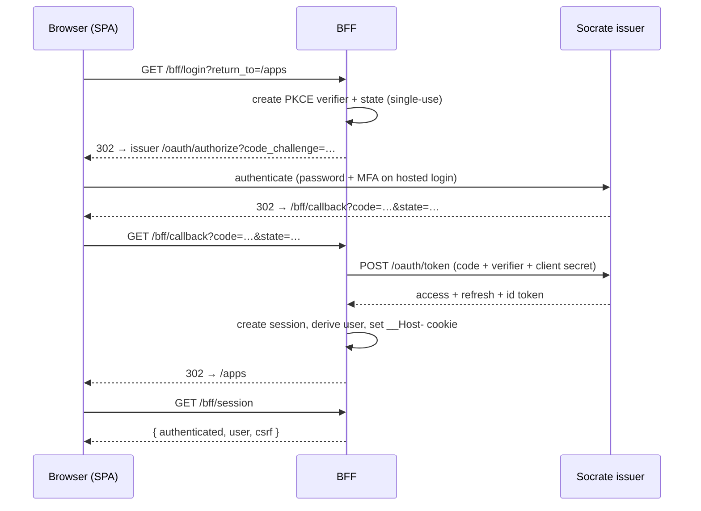

# Architecture — BFF cookie-session model

The Socrate admin console is a Vue 3 SPA that holds **no OAuth tokens**. A small
Go **Backend-for-Frontend (BFF)** is the confidential OAuth client: it runs the
Authorization Code + PKCE flow server-side, keeps the access/refresh tokens in a
server-side session, and the browser only ever holds an opaque, HttpOnly session
cookie. Every authenticated request the browser makes is **same-origin**; the BFF
injects the bearer on the way to the upstream.

This is the result of a four-phase migration away from the original model (the
SPA drove PKCE itself and held the access token in memory). See
[History](#history) for the phases.

## Topology

```
                         admin.vandermoten.eu (Caddy — only public listener)
  ┌──────────┐  HTTPS    ┌───────────────────────────────────────────────┐
  │ Browser  │ ───────▶  │  /                → file_server (built SPA)     │
  │          │           │  /bff/*           ┐                             │
  │ holds:   │           │  /api/admin/*     ├─▶ reverse_proxy 127.0.0.1:8091
  │  • cookie│           │  /api/profile     ┘   (admin BFF)               │
  │  • csrf  │           └───────────────────────────────────────────────┘
  └──────────┘                                 │ loopback only
                                               ▼
                         ┌─────────────────────────────────────────────┐
                         │  admin BFF (Go, stdlib)                      │
                         │   • confidential OAuth client (id + secret)  │
                         │   • server-side session store                │
                         │   • injects Bearer, strips Cookie            │
                         └─────────────────────────────────────────────┘
                            │ 127.0.0.1:8081            │ 127.0.0.1:8080
                            ▼                           ▼
                   ┌──────────────────┐      ┌────────────────────────┐
                   │ admin API (:8081)│      │ Socrate issuer (:8080) │
                   │ /api/admin/*     │      │ /oauth/*, /api/profile │
                   └──────────────────┘      └────────────────────────┘
```

The admin API (`:8081`) is **loopback only** — the BFF is its sole client. The
issuer's public origin (`socrate.vandermoten.eu`) is used only for the
browser-facing authorize redirect and the two public pre-auth flows
(forgot/reset password); all authenticated issuer calls go over loopback.

## What the browser holds

| | Stored where | Notes |
|---|---|---|
| Session id | `__Host-admin_session` cookie | HttpOnly · Secure · `SameSite=Strict` · `Path=/` |
| CSRF token | in-memory (`csrfStore`) | from `GET /bff/session`; echoed in `X-CSRF-Token` |
| Access / refresh / id token | **never** — server-side only | held in the BFF session |

## BFF endpoints

| Method | Path | Purpose |
|---|---|---|
| `GET`  | `/bff/login`    | Start PKCE login → 302 to the issuer `/oauth/authorize` |
| `GET`  | `/bff/callback` | Validate `state`, exchange code, mint session, set cookie, 302 to `return_to` |
| `GET`  | `/bff/session`  | Bootstrap: `{ authenticated, user, csrf }` |
| `POST` | `/bff/logout`   | Revoke session + clear cookie |
| `POST` | `/bff/elevate`  | Server-side step-up; absorbs the elevated token into the session |
| `*`    | `/api/admin/*`  | Inject bearer, proxy to the admin API (SSE-aware) |
| `GET`/`PUT` | `/api/profile` | Inject bearer, proxy to the issuer (allowlisted self-service) |
| `GET`  | `/bff/healthz`  | Liveness |

Everything else returns 404 — the BFF is a strict allowlist, never an open proxy.

## Login flow



## Authenticated request flow

```mermaid
sequenceDiagram
    participant B as Browser (SPA)
    participant F as BFF
    participant A as Admin API (loopback)
    B->>F: POST /api/admin/apps  (cookie + X-CSRF-Token)
    F->>F: resolve session; constant-time CSRF compare
    F->>F: ensureFresh() — refresh token if within 30s of expiry
    F->>A: POST /api/admin/apps  (Authorization: Bearer …, no Cookie)
    A-->>F: 200
    F-->>B: 200
```

Safe methods (`GET`/`HEAD`/`OPTIONS`) skip the CSRF check. On `401` from the
upstream the BFF deletes the session and clears the cookie; the SPA then routes
to login.

## Security properties

- **No replayable bearer in the browser** — the boundary is the HttpOnly cookie.
- **Confidential client** — `client_id` + secret live only in the BFF.
- **CSRF** — `SameSite=Strict` cookie + double-submit `X-CSRF-Token`
  (constant-time compare) on every state-changing request.
- **Token refresh** — proactive, server-side, serialized per session under a
  lock so the rotating refresh token is used once; rotation/replay handled by
  the issuer's `/oauth/token`.
- **Step-up** — `/bff/elevate` re-authenticates server-side and absorbs the
  short-lived elevated token into the session; it never reaches the browser.
- **Session lifetime** — idle (30m) + absolute (8h), swept on a background ticker.
- **Identity** — derived by base64-decoding the access-token JWT payload (no
  signature verify: own server over loopback; the boundary is the cookie).

## Configuration

The SPA needs almost no config — it talks to its own origin:

| Var | Default | Used for |
|---|---|---|
| `VITE_ADMIN_API_URL` | `""` (same-origin) | admin API base; set only for split-origin |
| `VITE_OIDC_ISSUER`   | `""` (same-origin / dev proxy) | public pre-auth flows (forgot/reset password) only |

The BFF is configured via `BFF_*` env vars — see [`bff/README.md`](../bff/README.md).
Production wiring (Caddy + systemd + secrets) is in [`deploy/`](../deploy/README.md).

## History

| Phase | What landed |
|---|---|
| SPA hardening | Authorization Code + PKCE migration, step-up, forced password change, CSP + Trusted Types, two-origin split |
| BFF Phase 1 | Allowlisted, SSE-aware reverse proxy to the admin API |
| BFF Phase 2 | Server-side sessions, confidential client, opaque cookie |
| Phase 3 | SPA switch — removed all token handling; same-origin cookie client |
| Phase 4 | Profile self-service through the BFF — fully cookie-only |
