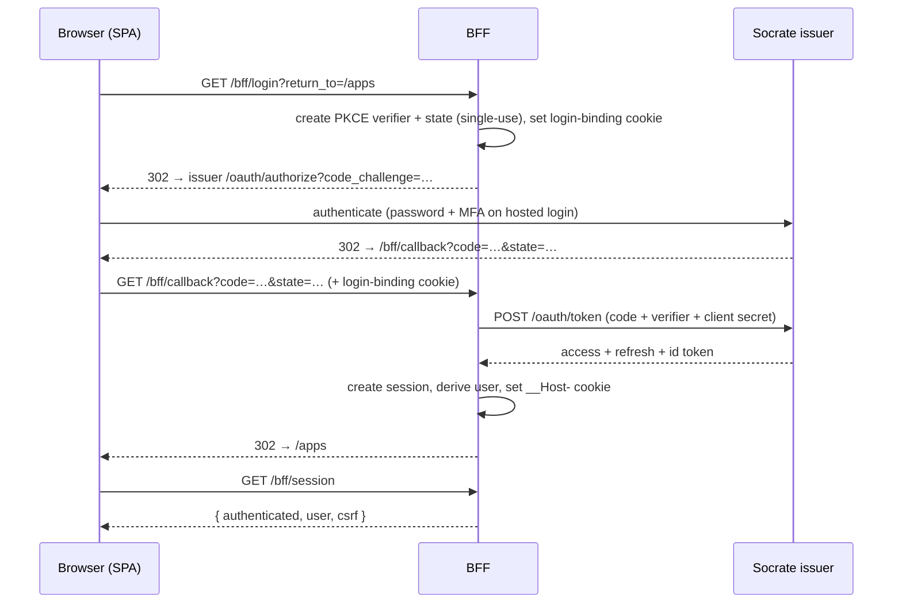

# Architecture: the BFF cookie-session model

The Socrate admin console is a Vue 3 SPA that holds **no OAuth tokens**. A small Go
Backend-for-Frontend (BFF) is the confidential OAuth client: it runs the Authorization Code +
PKCE flow server-side, keeps the access and refresh tokens in a server-side session, and the
browser only ever holds an opaque, HttpOnly session cookie. Every authenticated request the
browser makes is **same-origin**; the BFF injects the bearer on the way to the upstream.

The BFF is built on the `bff` package of [backendkit](https://github.com/ovander/backendkit),
which provides the session store, cookies, PKCE, the reverse proxy and the session-to-bearer
gateway. The console-specific code is in [`bff/`](../bff/README.md).

## Topology

```
                         admin.example.com  (Caddy, the only public listener)
  ┌──────────┐  HTTPS    ┌─────────────────────────────────────────────────────┐
  │ Browser  │ ───────▶  │  /                        → file_server (built SPA) │
  │          │           │  /bff/*                    ┐                        │
  │ holds:   │           │  /api/admin/*              │                        │
  │  • cookie│           │  /api/apps/*               │                        │
  │  • CSRF  │           │  /api/profile              ├─▶ reverse_proxy        │
  └──────────┘           │  GET /api/version          │   127.0.0.1:8091       │
                         │  POST /api/auth/request-   │   (admin BFF)          │
                         │       password-reset       │                        │
                         │  POST /api/auth/reset-     │                        │
                         │       password             ┘                        │
                         └─────────────────────────────────────────────────────┘
                                               │ loopback only
                                               ▼
                         ┌─────────────────────────────────────────────┐
                         │  admin BFF (Go, backendkit/bff)             │
                         │   • confidential OAuth client (id + secret) │
                         │   • server-side session store               │
                         │   • injects Bearer, strips Cookie           │
                         └─────────────────────────────────────────────┘
                            │ 127.0.0.1:8081          │ 127.0.0.1:8080
                            ▼                         ▼
                   ┌────────────────────┐    ┌──────────────────────────┐
                   │ admin API (:8081)  │    │ Socrate issuer (:8080)   │
                   │ /api/admin/*       │    │ /oauth/*, /api/profile,  │
                   │ /api/apps/*        │    │ /api/version, /api/auth/*│
                   └────────────────────┘    └──────────────────────────┘
```

The admin API (`:8081`) is **loopback only**; the BFF is its sole client. The issuer's public
origin (for example `socrate.example.com`) is used only for the browser-facing authorize
redirect and Socrate's hosted login. All the calls the BFF makes to the issuer (token exchange,
refresh, revocation, `/api/profile`, `/api/version`, password reset) go over loopback.

## What the browser holds

| | Stored where | Notes |
|---|---|---|
| Session id | `__Host-admin_session` cookie | HttpOnly · Secure · `SameSite=Strict` · `Path=/` |
| CSRF token | in memory (`csrfStore`) | from `GET /bff/session`; echoed in `X-CSRF-Token` |
| Access / refresh / id token | **never**, server-side only | held in the BFF session |

## BFF endpoints

| Method | Path | Purpose |
|---|---|---|
| `GET`  | `/bff/login`    | Start PKCE login, 302 to the issuer's `/oauth/authorize` |
| `GET`  | `/bff/callback` | Check `state` and the login-binding cookie, exchange the code, create the session, set the cookie, 302 to `return_to` |
| `GET`  | `/bff/session`  | Bootstrap: `{ authenticated, user, csrf }` |
| `POST` | `/bff/logout`   | Revoke the tokens, drop the session, clear the cookie |
| `POST` | `/bff/elevate`  | Server-side step-up; absorbs the elevated token into the session |
| `*`    | `/api/admin/*`  | Inject the bearer, proxy to the admin API (SSE-aware) |
| `*`    | `/api/apps/*`   | Same, for the app-scoped users and activity routes of the admin API |
| `*`    | `/api/profile`  | Inject the bearer, proxy to the issuer (profile self-service) |
| `GET`, `POST` | `/api/profile/mfa`, `/api/profile/mfa/{enroll,confirm,recovery-codes,disable}` | Same, for MFA self-service; each method and path listed |
| `GET`  | `/api/version`  | Public version probe, proxied to the issuer |
| `POST` | `/api/auth/request-password-reset`, `/api/auth/reset-password` | Public pre-auth flows, proxied to the issuer without the cookie or any `Authorization` header |
| `GET`  | `/bff/healthz`  | Liveness |

Everything else returns 404: the BFF is a strict allowlist, never an open proxy.

## Login flow


```mermaid
sequenceDiagram
    participant B as Browser (SPA)
    participant F as BFF
    participant S as Socrate issuer
    B->>F: GET /bff/login?return_to=/apps
    F->>F: create PKCE verifier + state (single-use), set login-binding cookie
    F-->>B: 302 → issuer /oauth/authorize?code_challenge=…
    B->>S: authenticate (password + MFA on hosted login)
    S-->>B: 302 → /bff/callback?code=…&state=…
    B->>F: GET /bff/callback?code=…&state=… (+ login-binding cookie)
    F->>S: POST /oauth/token (code + verifier + client secret)
    S-->>F: access + refresh + id token
    F->>F: create session, derive user, set __Host- cookie
    F-->>B: 302 → /apps
    B->>F: GET /bff/session
    F-->>B: { authenticated, user, csrf }
```

## Authenticated request flow

```mermaid
sequenceDiagram
    participant B as Browser (SPA)
    participant F as BFF
    participant A as Admin API (loopback)
    B->>F: POST /api/admin/apps  (cookie + X-CSRF-Token)
    F->>F: resolve session; constant-time CSRF compare
    F->>F: refresh the token if within 30s of expiry
    F->>A: POST /api/admin/apps  (Authorization: Bearer …, no Cookie)
    A-->>F: 200
    F-->>B: 200
```

Safe methods (`GET`/`HEAD`/`OPTIONS`) skip the CSRF check. Without a valid session the BFF
answers 401. If the issuer rejects the refresh token, the BFF deletes the session, clears the
cookie and answers 401; if the token endpoint is unreachable it answers a retryable 502 and keeps
the session. On any 401 the SPA clears its CSRF token and cached user and routes to the sign-in
page.

## Security properties

- **No replayable bearer in the browser**: the boundary is the HttpOnly cookie.
- **Confidential client**: `client_id` and secret live only in the BFF.
- **CSRF**: `SameSite=Strict` cookie plus the double-submit `X-CSRF-Token` (constant-time
  compare) on every state-changing request, logout included.
- **Login binding**: the callback completes only for the browser that started the login.
- **Token refresh**: proactive and server-side; concurrent refreshes for one session are
  coalesced so the rotating refresh token is used once. Rotation and replay detection are the
  issuer's.
- **Step-up**: `/bff/elevate` re-authenticates server-side and absorbs the short-lived elevated
  token into the session; it never reaches the browser.
- **Session lifetime**: idle (30 minutes) and absolute (8 hours) by default, swept every
  minute.
- **Identity**: derived by decoding the access-token payload without verifying the signature.
  The token comes straight from the issuer over loopback and is never accepted from the
  browser; the admin API verifies it on every call.

## Configuration

The SPA needs almost no configuration; it talks to its own origin:

| Variable | Default | Used for |
|---|---|---|
| `VITE_ADMIN_API_URL` | unset (same origin) | admin API base; set only for a split-origin setup |
| `VITE_OIDC_ISSUER`   | unset | parsed and checked, but not used by any request today |

The BFF is configured with `BFF_*` variables; see [`bff/README.md`](../bff/README.md#configuration).
Production wiring (Caddy, systemd, secrets) is in [`deploy/`](../deploy/README.md).

## History

The console first drove PKCE itself and held the access token in memory. It moved to the BFF
model in steps: an allowlisted proxy in front of the admin API, then server-side sessions with
the confidential client, then an SPA with no token handling at all, and finally profile
self-service through the BFF. The session-less pass-through mode that served the migration
still exists behind an explicit opt-in (`BFF_PHASE1_PASSTHROUGH`), for migration only; see
[`bff/README.md`](../bff/README.md#pass-through-mode-migration-only).
